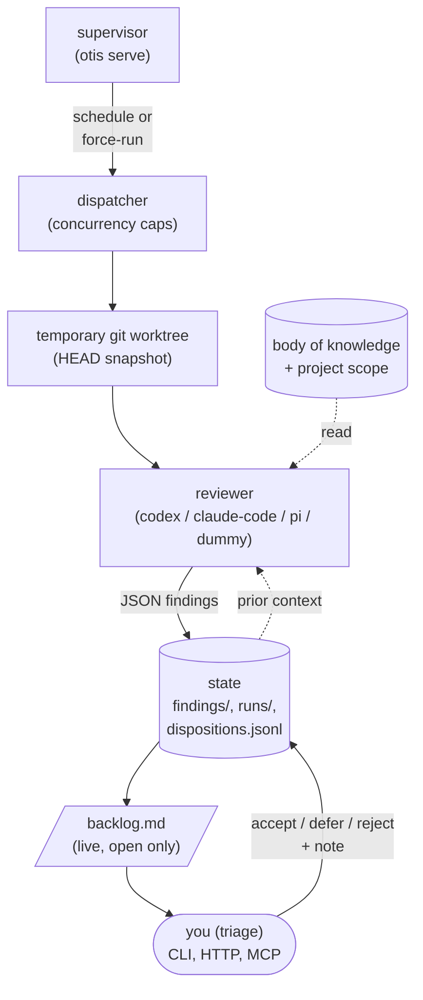

# 1. Concepts

Otis is a long-running supervisor that periodically reviews the codebases
you assign to it, using a body of knowledge you maintain. It does not write
code, it does not push changes, and it does not pull from upstream. It
reads, finds, records, and waits for a human to triage.

This chapter names the moving parts. The rest of the guide assumes the
vocabulary defined here.

## The Loop

A pass fires when its cadence is due and its reviewer window is open. The
dispatcher snapshots the project's `HEAD` into a throwaway worktree, hands
the reviewer a bounded prompt assembled from the BoK slice plus the
in-scope code, validates the JSON the reviewer returns, writes immutable
run artifacts, and updates the live findings and backlog. Then it waits
for you.

## Vocabulary

**Supervisor.** The `otis serve` process. It owns scheduling, dispatch,
state writes, and the HTTP(S) API. Workstation commands and the MCP bridge
never touch the state directory directly; they go through the supervisor.

**Body of knowledge (BoK).** A directory tree of markdown entries that
describe the architectural perspective Otis reviews against. Entries live
under category subtrees like `vocabulary/`, `layering/`, and
`cognitive-load/`. Project-specific guidance lives under
`projects/<name>/`. Root-level markdown is not BoK content. See
[03-body-of-knowledge.md](03-body-of-knowledge.md).

**Project.** A supervised codebase. Declared in the global config with a
`name`, a local `path`, and an optional `config` override. By default the
project's per-project YAML lives at `<bok.path>/projects/<name>/otis.yaml`.

**Pass.** A named review task scoped to a project. A pass declares its
scope (which files), its BoK slice (which guidance), its reviewer, a
cadence, a window, and a `top_findings` cap.

**Scope.** What the reviewer sees. Three kinds: `full` (every tracked
file, bounded), `paths` (explicit paths and globs, bounded), and `recent`
(first-parent commits whose committer timestamps fall in the pass window).

**Reviewer.** A read-only adapter around a model CLI. Otis ships four:
`dummy` (deterministic, file-backed), `codex`, `claude-code`, and `pi`.
See [05-reviewers.md](05-reviewers.md).

**Finding.** A single issue produced by a reviewer. Canonical IDs look
like `testproj/vocabulary-sweep/0001`: project, pass, zero-padded sequence.
Findings carry severity, title, location, BoK references, description, and
a suggested fix.

**Disposition.** A human decision on a finding: `open`, `accepted`,
`deferred`, or `rejected`. Triage commands attach a note, append an event
to `dispositions.jsonl`, and re-render `backlog.md`. Accepted, deferred,
and rejected findings disappear from the backlog but stay in prior context
for the next pass, which is how Otis avoids re-raising things you have
already decided.

**Cadence vs window.** Cadence (`24h`, `4h`, etc.) controls *how often* a
pass is eligible to fire. Window (`anytime`, `manual`, `22:00-06:00`)
controls *when* the reviewer is allowed to run. A force-run bypasses both
but still respects concurrency caps.

**Run artifacts.** Each run writes an immutable directory under
`projects/<project>/runs/<date>/<pass>/<time-seq>/`: `prompt.md`,
`output.json`, `findings.json`, `report.md`, and `git-head.txt`. These are
the audit trail. They are not re-rendered when a finding's disposition
changes.

**Backlog.** `projects/<project>/backlog.md` is a live rendered view of
open findings only. It is regenerated on every state mutation.

## What Otis Is Not

Otis does not pull, fetch, rebase, or push. Synchronization of supervised
repositories is someone else's job (e.g., Sexton, cron, your CI). Otis
reviews whatever commit is at `HEAD` when a pass fires.

Otis is not a retry engine. Failed runs consume their cadence cycle; if
you want a re-run, force one.

Otis does not propose diffs, apply remediations, or run on commit/PR
events today — see [../deferred.md](../deferred.md) for the list of
intentionally unbuilt capabilities.

---

Next: [02-quickstart.md](02-quickstart.md) walks you through the demo so
you can watch every term defined above happen on your own machine.
