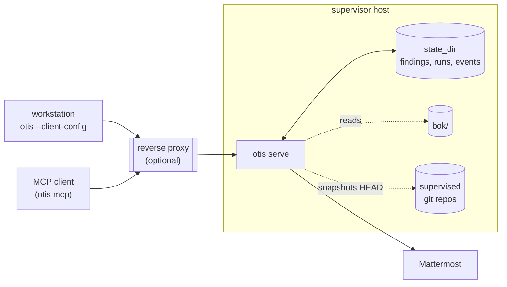

# 6. Deployment

This chapter is what a real installation looks like: install the binary,
choose state and BoK locations, run the supervisor reliably, decide on
TLS, issue and rotate workstation tokens, and optionally wire up
Mattermost.

The HTTP, CLI, and MCP surfaces themselves are documented in
[../api.md](../api.md). Operational behavior (worktree pruning, atomic
writes, audit logs) is documented in [../operations.md](../operations.md).

## Topology



In a minimal deployment the workstation talks directly to the supervisor
over HTTP or HTTPS. In production it usually goes through a reverse
proxy that terminates TLS, handles auth headers, and exposes the
supervisor at a stable hostname.

## Install

Build and install with Go 1.26 or newer:

```bash
git clone <your-otis-fork-or-checkout>
cd otis
go install ./...
```

`go install` drops the binary at `$(go env GOPATH)/bin/otis`. Put that
directory on the supervisor host's PATH for the user that will run the
service.

The `Makefile` also exposes:

```bash
make build   # go install $(TARGETS)
make test    # go vet ./... && go test ./... -count=1
```

`make test` is what you run after upgrading; it catches adapter and
config regressions before they touch real state.

## Lay Out the Filesystem

The supervisor needs:

- A **BoK checkout**. Usually a long-lived `otis-bok` git repo on the
  supervisor host that BoK authors deploy to via `git pull` (Otis itself
  never modifies the BoK).
- A **state directory**. Pick a durable path you back up. Otis never
  deletes from here.
- A **global config** file (`global.yaml`).
- Optional: a directory of supervised repos. The supervisor reads from
  whatever `projects[*].path` points at, but never syncs them itself.

A common layout:

```
/srv/otis/
├── bok/                       # otis-bok checkout
├── state/                     # storage.state_dir
├── repos/                     # supervised git checkouts
└── global.yaml
```

With `global.yaml` like:

```yaml
bok:
  path: /srv/otis/bok

storage:
  state_dir: /srv/otis/state

api:
  listen: "127.0.0.1:8443"

projects:
  - name: alpha
    path: /srv/otis/repos/alpha
  - name: beta
    path: /srv/otis/repos/beta
```

Relative paths in `global.yaml` resolve against the directory of
`global.yaml` itself, not the supervisor's `$PWD`.

## Validate Before Starting

```bash
otis config check /srv/otis/global.yaml
otis bok list --bok-path /srv/otis/bok
```

`config check` resolves all relative paths and runs the same validation
as `serve`. It is safe to run after every config edit.

## Run the Supervisor

Foreground (development, ad-hoc):

```bash
otis --config /srv/otis/global.yaml serve
```

One-shot tick (CI, cron-driven control planes):

```bash
otis --config /srv/otis/global.yaml serve --once
```

`serve --once` runs a single scheduler tick, waits for queued work to
complete, and exits. This is the right mode if you want an external
scheduler to own cadence.

For long-running deployments, run under a process supervisor. A minimal
systemd unit:

```ini
# /etc/systemd/system/otis.service
[Unit]
Description=Otis continuous code-quality supervisor
After=network-online.target
Wants=network-online.target

[Service]
Type=simple
User=otis
Group=otis
WorkingDirectory=/srv/otis
ExecStart=/usr/local/bin/otis --config /srv/otis/global.yaml serve
Restart=on-failure
RestartSec=5s

# Mattermost token (when configured)
Environment=MATTERMOST_TOKEN=...

[Install]
WantedBy=multi-user.target
```

Then:

```bash
sudo systemctl daemon-reload
sudo systemctl enable --now otis
sudo journalctl -u otis -f
```

Config reload is not implemented today (see
[../deferred.md](../deferred.md)) — restart the service after editing
`global.yaml`, a profile, or a project config:

```bash
sudo systemctl restart otis
```

## TLS

The supervisor serves HTTP unless **both** `api.tls.cert` and
`api.tls.key` are configured. When both are set it serves HTTPS.
Configuring only one is invalid.

### Direct HTTPS

```yaml
api:
  listen: "0.0.0.0:8443"
  tls:
    cert: /etc/otis/tls/otis.crt
    key:  /etc/otis/tls/otis.key
```

Workstation `client.yaml` for direct HTTPS with a non-public CA:

```yaml
url: https://otis.example.com:8443
token: <issued token>
tls:
  ca_cert: /etc/otis/tls/ca.crt
```

### Reverse Proxy

Terminate TLS at nginx, Caddy, or your ingress controller. Keep the
supervisor on plain HTTP behind it:

```yaml
api:
  listen: "127.0.0.1:8443"
```

```yaml
# workstation
url: https://otis.example.com
token: <issued token>
```

This is the recommended shape for any deployment that needs a stable
hostname, ACME-managed certificates, or shared L7 features (rate limits,
IP allowlists).

## Workstation Tokens

Every API call is authenticated with a bearer token. Issue one:

```bash
otis --config /srv/otis/global.yaml admin token issue --label <label>
```

`--label` is a human-readable identifier (an operator name, a CI job
name). It is stored alongside the token so you know what to revoke
later.

Each workstation gets its own `client.yaml`:

```yaml
url: https://otis.example.com
token: <issued token>
```

Treat tokens like credentials: keep them out of source control, ship
them via your secret distribution mechanism, and rotate them by issuing
new ones and discarding old `client.yaml` files. (Token revocation
beyond regenerating the supervisor's token store is a deployment
concern; the supervisor reads the store at start.)

## Mattermost Notifications (Optional)

Non-empty pass runs post one message per run to the project's channel.
Configure the webhook in `global.yaml`:

```yaml
notification:
  mattermost:
    url: https://chat.example.com/hooks/your-webhook-id
    token_env: MATTERMOST_TOKEN
  report_base_url: https://otis.example.com
```

- `url` is the Mattermost incoming-webhook URL.
- `token_env` names the environment variable that holds the token Otis
  posts with. The supervisor reads it at start; supply it via the
  service unit's `Environment=` directive or your secret manager.
- `report_base_url` is the public base URL that notifications prefix to
  run-report links so the Mattermost message points at something a
  human can click.

Per-project channel override lives in project config:

```yaml
project:
  notify:
    mattermost: "#otis-alpha"
```

Without an override, notifications go to `#otis-<project>`. Leave
`notification.mattermost.url: ""` to disable Mattermost entirely.

The expected message shape is in
[`docs/example/mattermost-message.md`](../../example/mattermost-message.md).

## Deployment Checklist

- [ ] `otis version` runs on the supervisor host and the workstations.
- [ ] BoK checkout is in place at `bok.path` and `otis bok list` prints
  the entries you expect.
- [ ] `storage.state_dir` is on durable, backed-up storage.
- [ ] `otis config check global.yaml` passes.
- [ ] Supervised repos exist at `projects[*].path` and have at least one
  commit (Otis snapshots HEAD).
- [ ] TLS is either direct (cert + key configured) or terminated at a
  reverse proxy.
- [ ] At least one workstation token has been issued and the matching
  `client.yaml` exists on the workstation.
- [ ] `otis serve` runs under a process supervisor that restarts it on
  failure.
- [ ] If Mattermost is wired, the token environment variable is set in
  the service unit and a test notification posts.
- [ ] An MCP client (Claude, Cursor) is configured with
  `docs/example/mcp.json` and the workstation `client.yaml` if you plan
  to triage through MCP.

---

Next: [07-day-to-day.md](07-day-to-day.md) — what running Otis looks
like once it is in place.
