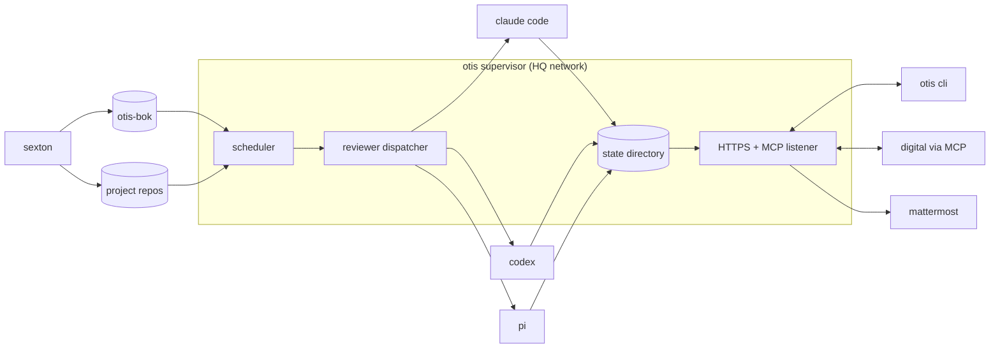

# Otis — Spec

This document describes the design of otis, the continuous code-quality agent. The companion vision document at `software/otis/otis-vision.md` in the grimoire frames the problem and thesis; this document covers the shape of the system itself — the components, protocols, data, configuration, and surfaces.

The explicit target of this spec is the *minimal harness*: get something running that we can build the body of knowledge against iteratively. Higher-permission operating modes, multi-reviewer panels, autonomous remediation, and similar elaborations are deferred. Each deferral is named, with reasoning, in the section near the end of this document.

## What This Spec Covers

Otis is a continuous code-quality agent that watches a codebase against a body of architectural guidance and surfaces findings for human triage. The body of knowledge (BoK) is the crown jewel of the project; otis itself is the access pattern — the harness that operationalizes the BoK against codebases on a heartbeat.

This spec covers both the harness and the structural shape of the BoK. The BoK's actual content is harvested over time and lives outside this spec's scope. An otis distribution ships with a limited example BoK so the system is demonstrable; the real, calibrated BoK stays inside the practice.

## Shape

Otis is a singleton service running on the HQ network. It dispatches fresh-context review passes against supervised repositories, accumulates findings to a durable backlog, and exposes those findings to humans and digital collaborators through a thin set of network surfaces.



Five elements hang off the supervisor.

The **scheduler** tracks which passes are due based on each pass's cadence and the global scheduling windows, and queues them for dispatch.

The **reviewer dispatcher** invokes a reviewer subprocess (claude code, codex, or pi) in fresh context per pass, with a constructed prompt and a JSON output schema. Concurrency caps per reviewer plus a global cap prevent the supervisor from saturating the host or burning unbounded tokens.

The **HTTPS + MCP listener** exposes the supervisor's state and operations to two audiences. Humans interact through a REST API consumed by an `otis` CLI on each workstation. Digitals interact through an MCP server whose tools mirror the REST endpoints. Bearer-token authentication for both.

The **state directory** persists everything that matters across supervisor restarts: pass-run history, finding objects, dispositions, rendered backlogs, prompt snapshots, raw reviewer outputs, supervisor lifecycle events.

The **body of knowledge** is a separate git repository, sexton-synced. The supervisor maintains an embedding index over it and resolves each pass's declared concerns to a slice of entries via semantic search.

The supervisor itself is a deterministic Go process. The cognitive work happens inside the reviewer subprocesses; the supervisor doesn't accumulate context or make judgment calls. It schedules, dispatches, persists, and routes — normal operational machinery you can reason about with standard tooling.

## The Body of Knowledge

The BoK is a focused, private git repository (anticipated at `git.hq.quigley.com/products/otis-bok`) synchronized by sexton the same way the grimoire is. The supervisor reads from a local checkout that sexton keeps current.

Entries are markdown files, lore-shaped. Light frontmatter for indexing and scoping; free-form prose for the guidance itself. The frontmatter fields otis cares about are `title`, `applies_to` (a list of project names, defaulting to `[all]` when absent), and `tags` (free-form, for human navigation and as soft anchors for semantic search). The body is conventional but not enforced: sections like `## guidance`, `## why`, `## examples`, and `## related` recur because they earn their place, but the reviewer reads the whole entry and understands the guidance regardless of structure.

```markdown
---
title: lens vs view vocabulary preference
tags: [vocabulary, naming]
applies_to: [all]
created: 2026-05-13
---

# lens vs view vocabulary preference

Across the codebases, "lens" is the established term for a perspectival
or filtered view of data — see HiveLens, libraryLens, etc. Some
subsystems have drifted into using "view" interchangeably with the same
meaning.

## guidance

Prefer "lens" over "view" in new code for perspectival data surfaces.
When reviewing existing code, flag places where "view" appears in
contexts where "lens" would match the established convention. Don't
flag "view" when it's being used in its more general sense — only the
lens-as-perspectival-surface sense.

## why

Vocabulary consistency reduces cognitive load when navigating across
modules. The cost of standardization is low; the benefit compounds as
the codebase grows.
```

The BoK repository layout is conventional:

```
otis-bok/
  vocabulary/
  layering/
  cognitive-load/
  projects/
    baab/
    lore/
  README.md
```

Top-level directories are conceptual buckets — vocabulary, layering, cognitive-load, and so on. The actual set evolves as the BoK grows; this list is illustrative. The `projects/<name>/` subtree is where project-bound entries live when they're fine in the central repo.

Project-specific augmentations that aren't fit to share live in-project at `<project>/.otis/bok/`, by convention rather than configuration. The supervisor merges both locations into the corpus when serving a project; both layers participate in the same semantic search. Convention is preferred over configuration throughout otis: project repos declare their otis content at known paths, and the supervisor discovers it without explicit registration.

The supervisor maintains an embedding index over the merged corpus. At pass time, each pass's `concerns` list resolves to a slice of top-K BoK entries via semantic similarity, which are assembled into the reviewer's prompt as context. Findings' `bok_refs` point at the specific entries that contributed, so a human triaging a finding can read exactly which guidance the reviewer was working from.

The indexing approach is borrowed from lore. The two implementations are deliberately duplicated for now; the shared abstraction is expected to be extracted into a library once both have stabilized, but that extraction is not part of this spec. The planning agent has access to lore's code and will firm up the implementation-level details.

## The Pass

A pass is the unit of work. Each pass is a single fresh-context invocation of a reviewer against a configured slice of code and a configured slice of BoK, producing a structured set of findings.

### Scope

Each pass declares scope along two axes — project scope (what code to look at) and BoK scope (what guidance to apply).

Project scope has three types in the minimal harness:

- `full` — the entire project tree.
- `paths` — an explicit list of paths or globs within the project.
- `recent` — code touched within a time window (e.g., the last 24 hours).

BoK scope is expressed as a list of *concerns* — short identifiers that resolve to BoK entries via semantic search. `concerns: [vocabulary, naming]` retrieves the top-K BoK entries semantically related to those terms. Because resolution is search-based rather than tag-based, the BoK can grow without project configs needing to change.

### Cadence and Windows

Passes don't declare wall-clock schedules. They declare *cadence* — how often the pass should run. The supervisor decides when to actually fire each pass, fitting cadences into global scheduling windows defined in the global config.

Cadence is a duration: `cadence: 24h`, `cadence: 6h`, `cadence: 1w`. Shorthand aliases (`daily`, `weekly`, `hourly`) parse to the obvious durations.

Windows are named time ranges declared in the global config — `overnight`, `working-hours`, `anytime`, and any custom names the operator wants. Each reviewer is assigned a window in the global config; passes inherit that window through their reviewer. A daily pass on a reviewer assigned to the `overnight` window fires once per night within that window; a 6-hourly pass on a reviewer assigned to `anytime` fires four times a day distributed across all hours.

The supervisor's scheduling job is: keep a running view of which passes are due (`now - last_run >= cadence`), pick from due passes while respecting per-reviewer and global concurrency caps, and prefer not to bunch up firings of many cheap passes at startup.

### Top-N Discipline

Each pass declares `top_findings: N` — the maximum number of findings the reviewer should return. The default at the project level is low (3 is the suggested default), biasing the whole system toward terse high-signal output.

The semantics are *best N*, not *up to N*. The reviewer's prompt instructs it to rank candidate findings by impact on cognitive load and return only the top N. Returning fewer findings is correct when nothing stronger exists; zero findings is a valid output when the codebase is clean for that pass's concerns.

This discipline is enforced in the global reviewer prompt template rather than per-pass, so all reviewers across all passes operate under the same instruction. The vision doc's calibration target — *reduce cognitive load*, not *find smells* — is what `top_findings` operationalizes.

### The Reviewer Interface

Each reviewer (claude code, codex, pi) implements a small interface: accept an assembled prompt and a JSON output schema; run in fresh, read-only context; return structured findings.

The dispatcher constructs the prompt with a fixed shape:

1. **Role and goal.** Otis-reviewer for pass `X` on project `Y`; the goal is to surface the top N findings that would reduce cognitive load.
2. **BoK slice.** The semantically-resolved entries for this pass's concerns.
3. **Project context.** Anything from `<project>/.otis/bok/` plus relevant project metadata.
4. **Scope content.** The actual code or diff in scope.
5. **Open backlog.** Existing findings already in the backlog, with their descriptions and dispositions, so the reviewer can reference existing IDs rather than create duplicates.
6. **Output schema and budget.** The finding JSON schema and the `top_findings` cap.

The dispatcher then invokes the reviewer in print mode:

- **Claude Code**: `claude -p ... --output-format json --json-schema ... --bare --allowedTools <read-only> --permission-mode plan`
- **Codex**: `codex exec` with read-only sandbox flags and the schema.
- **Pi**: `pi -p ... --mode json` configured with read-only tool access via permission-gate extension or sandboxing.

Each reviewer adapter enforces the read-only invocation discipline for its harness. The minimal harness operates at the conservative end of the permission gradient (see Deferred): reviewers can read code but never write.

### The Finding

A finding is the unit of output. The schema:

```json
{
  "id": "baab/vocab/0042",
  "project": "baab",
  "pass": "vocabulary-sweep",
  "reviewer": "pi",
  "first_run": "2026-05-13/vocabulary-sweep",
  "created_at": "2026-05-13T06:04:23Z",
  "severity": "medium",
  "title": "inconsistent use of \"lens\" vs \"view\" in hive subsystem",
  "location": {
    "file": "internal/hive/library.go",
    "lines": "42-78"
  },
  "bok_refs": ["vocabulary/lens-vs-view"],
  "description": "The hive subsystem uses both \"lens\" and \"view\" interchangeably for the same conceptual surface...",
  "suggested_fix": "Standardize on \"lens\" throughout the hive subsystem.",
  "disposition": "open"
}
```

`id` follows `project/pass-slug/sequence` — lowercase, slash-delimited, sortable, readable in mattermost messages and CLI commands. Project and pass scope are baked in so IDs are globally unique within otis.

`reviewer` records which reviewer surfaced the finding. Useful for triage and for understanding finding character, since each reviewer's findings tend to read differently and the human's calibration develops over time.

`severity` is `low | medium | high` in the minimal harness.

`location` is file plus line range. AST-level anchors (function, type) are deferred.

`bok_refs` is the list of BoK entries that contributed to the reviewer's understanding. The reviewer is asked to populate this honestly — entries that actually shaped the finding, not all entries it was shown.

`description` and `suggested_fix` are prose from the reviewer, kept as distinct fields. The cost-calibration discipline (don't over-engineer fixes) is easier to enforce when the fix suggestion is in its own slot the reviewer can be instructed to keep minimal. The minimal harness operates with prose suggested fixes rather than structured diffs; this sits between pure level 1 and level 2 of the permission gradient.

`disposition` is `open | accepted | deferred | rejected`. The value on the finding object is a denormalized cache of the latest event in `dispositions.jsonl` (see State and Audit); API consumers read current state directly without replaying the event log.

### Cross-Run Identity

When a pass runs again and the same underlying issue is still present, the existing finding's ID gets reused rather than a new finding created. The mechanism is straightforward: otis includes the open backlog in the prompt to the reviewer, with each finding's description and location, and instructs the reviewer to reference existing IDs when surfacing the same issue.

Reviewer judgment is the dedupe heuristic. Content-hash dedupe could be added later if reviewer behavior turns out to be inconsistent, but trusting the reviewer keeps the protocol simple and matches the reviewer-agnostic discipline applied elsewhere.

## State and Audit

The state directory on disk persists everything that matters across supervisor restarts. The shape:

```
<state_dir>/
  supervisor/
    last-run.json          # per-pass last-fired timestamps, used for cadence due-checks
    events.jsonl           # supervisor lifecycle events (start, stop, pass dispatch)
  projects/
    baab/
      backlog.md           # rolling backlog of open findings across all passes (rendered view)
      dispositions.jsonl   # append-only log of finding lifecycle events (source of truth)
      findings/
        baab-vocab-0042.json   # one file per finding; created on first surfacing, mutable cache
      runs/
        2026-05-13/
          vocabulary-sweep/
            prompt.md      # the assembled prompt sent to the reviewer
            output.json    # raw structured output from the reviewer
            report.md      # human-readable report (mattermost links here)
            git-head.txt   # commit SHA of the project at pass-start time
```

`dispositions.jsonl` is the source of truth for finding state. Every finding creation and every disposition change is appended as a structured event with timestamp, actor, and any notes. The current state of any finding is derivable by replaying its events; the `disposition` field on the finding's JSON file is a denormalized cache regenerated on every change.

`backlog.md` is a rendered human-readable view of open findings, regenerated after each disposition change. It exists so humans browsing the state directory directly (in an editor, file browser, or git log) see something current; the API is the primary interaction surface.

`runs/YYYY-MM-DD/<pass-name>/` is the per-pass audit trail. Each run produces a fresh directory containing the assembled prompt, the raw reviewer output, a rendered markdown report, and the git HEAD at pass-start. Findings are always traceable to a specific commit, even when the working tree moves between runs.

## Configuration

Otis has two configuration files: per-project (`otis.yaml` at the project repo root) and global (location TBD by the planning agent — likely `/etc/otis/otis.yaml` or similar).

### Per-Project: `otis.yaml`

```yaml
project:
  name: baab
  description: groove-tagged drum library compositional tool
  notify:
    mattermost: "#otis-baab"
  top_findings: 3

passes:
  - name: vocabulary-sweep
    description: cross-module naming consistency
    scope:
      project: { type: full }
      bok:
        concerns: [vocabulary, naming]
    reviewer: { kind: pi }
    cadence: 24h

  - name: layering-check
    description: dependency-direction violations in /internal
    scope:
      project:
        type: paths
        paths: ["internal/"]
      bok:
        concerns: [layering, dependency-direction]
    reviewer: { kind: codex }
    cadence: 6h
    top_findings: 5

  - name: recent-changes-review
    description: structural review of the last day of commits
    scope:
      project:
        type: recent
        window: 24h
      bok:
        concerns: [architecture, cognitive-load]
    reviewer: { kind: claude-code }
    cadence: 24h
```

Project-level defaults (notification routing, finding budget) apply to all passes; individual passes override as needed.

### Global Config

```yaml
bok:
  path: /var/otis/bok

storage:
  state_dir: /var/otis/state

notification:
  mattermost:
    url: https://mm.hq.quigley.com
    token_env: MATTERMOST_TOKEN

reviewers:
  claude-code:
    binary: claude
    default_model: opus-4.7
    concurrency_cap: 2
    window: overnight
  codex:
    binary: codex
    default_model: gpt-5.4
    concurrency_cap: 2
    window: overnight
  pi:
    binary: pi
    default_model: ollama/llama3.3
    concurrency_cap: 4
    window: anytime

windows:
  overnight:
    hours: "22:00-06:00"
  working-hours:
    hours: "09:00-17:00"
  anytime:
    hours: "00:00-23:59"

global_concurrency_cap: 6

projects:
  - path: /repos/baab
  - path: /repos/lore
  - path: /repos/mercurius
```

Operator-level concerns live in the global config: BoK location, storage paths, mattermost details, reviewer binaries and models, concurrency caps, scheduling windows, and the list of supervised repository paths. Project configs don't see any of this — they declare intent, the operator declares policy.

Several knobs honor the convention-over-configuration preference: notification channel defaults to `#otis-<project-name>` if not specified, reviewer binaries default to looking on `PATH` if not given an explicit path, and the mattermost token reads from environment rather than from the config file.

## Interfaces

### HTTPS REST API

The supervisor exposes a REST API on the HQ network. The endpoints in the minimal harness:

```
GET    /api/v1/projects
GET    /api/v1/projects/{project}/passes
GET    /api/v1/projects/{project}/findings?disposition=open
GET    /api/v1/projects/{project}/findings/{id}
POST   /api/v1/projects/{project}/findings/{id}/disposition
GET    /api/v1/projects/{project}/runs/{date}/{pass}/report
POST   /api/v1/projects/{project}/passes/{pass}/run    # force-run
```

### The `otis` CLI

The same binary that runs the supervisor is installed on workstations as a thin client. The mode is determined by subcommand and config. `otis serve` runs the supervisor daemon; everything else hits the supervisor's API over HTTPS.

```
otis findings list [--project X] [--pass Y] [--open]
otis findings show FINDING-ID
otis accept FINDING-ID [--note "..."]
otis defer FINDING-ID [--note "..."]
otis reject FINDING-ID [--note "..."]
otis report show RUN-ID
otis projects list
otis passes list [--project X]
otis pass run PROJECT/PASS-NAME
```

Workstation configuration is a small file with the supervisor's URL and a bearer token, conventionally at `~/.config/otis/config.yaml`.

### MCP Server

The supervisor vends an MCP server whose tools mirror the REST surface. Digitals call them the way they call any other MCP tool.

The minimal harness exposes the read side plus disposition writes: `otis_list_findings`, `otis_get_finding`, `otis_get_report`, `otis_disposition_finding`. Operator actions (force-run a pass, reload config) are CLI-only in the minimal harness; MCP exposure can be added later if there's a real reason for a digital to trigger one.

### Authentication

Bearer tokens. Each workstation and each digital MCP client carries a token; the supervisor verifies on every request. Token storage on the supervisor is a simple file or directory of tokens with optional labels for which token belongs to whom. Token issuance is out-of-band (the operator generates tokens and distributes them).

mTLS is a reasonable long-term direction but adds operational overhead the minimal harness doesn't need yet.

## Repository Management

The supervisor needs local checkouts of every project it watches — for reading `otis.yaml`, scanning `<project>/.otis/bok/`, and feeding code content to reviewers (which operate on filesystem paths).

In the minimal harness, sexton handles repository sync. The operator declares the repository paths in the global config; sexton keeps those paths current using the same mechanism that keeps grimoire checkouts current across workstations. Otis itself does not perform git operations on supervised repositories.

The freshness model is loose. When a pass runs, the checkout's freshness is whatever sexton's last sync delivered. This is acceptable for the minimal harness — passes are about state-over-time, not real-time analysis. Otis records the git HEAD at pass-start in the run's audit trail, so every finding is traceable to a specific commit even if the working tree moves between runs.

If a declared project path doesn't exist when the supervisor starts (sexton hasn't run yet, or the path is misconfigured), the supervisor logs a warning and skips that project's passes. The operator can fix it and otis picks up on the next config reload. This is the right failure mode for a long-running supervisor — fail loud, keep running.

A future capability — `git worktree add` for ephemeral, clean checkouts at arbitrary refs — is anticipated. The pass configuration will grow a `git:` block declaring a ref and a `clean: true` flag, and the supervisor will spin up an ephemeral worktree in `<state_dir>/scratch/<run_id>/` for the duration of the pass. Sharing the object store with sexton's clone keeps this fast. The reviewer interface and pass schema have natural extension points for this. It is not part of the minimal harness.

## Notification

The minimal harness writes to mattermost. Other notification surfaces are pluggable (the notification subsystem is an interface in the supervisor with one implementation); adding email, webhook, or other surfaces is mechanical when the need surfaces.

Each pass run that produces findings posts one mattermost message to the configured channel. The shape:

```
otis: baab vocabulary-sweep, 2026-05-13
3 findings (1 high, 2 medium)

#1  inconsistent use of "lens" vs "view" in hive subsystem    [BAAB-VOCAB-0042]  medium
#2  "library" overloaded between hive and storage contexts    [BAAB-VOCAB-0043]  medium
#3  "tag" and "label" used interchangeably in groove API      [BAAB-VOCAB-0044]  high

Full report: <link to rendered report.md>
Triage: otis accept BAAB-VOCAB-0042 / otis defer BAAB-VOCAB-0042 / otis reject BAAB-VOCAB-0042
```

A pass run that produces zero findings posts no message; silence is a valid output. The pass's last-run timestamp still updates so the scheduler doesn't re-fire it before the cadence elapses.

## Scenarios

Three concrete walk-throughs.

### A Vocabulary Sweep Fires

The scheduler observes that the `baab/vocabulary-sweep` pass is due (last fired more than 24 hours ago, currently inside the `anytime` window for the `pi` reviewer). It allocates a worker slot from pi's concurrency pool and dispatches.

The dispatcher constructs the prompt: it resolves the pass's concerns (`[vocabulary, naming]`) against the BoK index, retrieving the top-K relevant entries — `vocabulary/lens-vs-view`, `vocabulary/library-overloads`, `naming/established-conventions`. It loads the project context from `/repos/baab/.otis/bok/` (a small set of project-specific augmentations), the project's full source tree (the pass declares `scope.project.type: full`), and the seven open findings in `baab/dispositions.jsonl`. It assembles all of this into a single prompt with the finding output schema and `top_findings: 3` cap.

The dispatcher invokes `pi -p ... --mode json` configured for read-only tool access. Pi runs in fresh context, reads what it needs from the filesystem, and emits structured findings on stdout. The dispatcher validates the output against the schema, writes the run's artifacts to `state/projects/baab/runs/2026-05-13/vocabulary-sweep/`, generates new finding records and appends `finding_created` events to `dispositions.jsonl`, renders an updated `backlog.md`, and posts a mattermost message to `#otis-baab` linking to the rendered report.

### A Human Triages a Finding

Michael, reading mattermost on his phone, sees the message above. He opens the linked report, reads finding `BAAB-VOCAB-0042`, agrees with it, and on his workstation runs:

```
otis accept BAAB-VOCAB-0042 --note "good catch; will fix as part of the hive refactor"
```

The CLI reads the local workstation config, looks up the supervisor URL and bearer token, and issues `POST /api/v1/projects/baab/findings/baab/vocab/0042/disposition` with body `{"disposition": "accepted", "note": "..."}`. The supervisor authenticates the request, appends an event to `dispositions.jsonl`, updates the finding's denormalized state, and re-renders `backlog.md`. The finding's status moves from open to accepted; the next vocabulary-sweep pass will see it in the backlog with that status and not re-surface the same issue.

### A Digital Queries Open Findings

A claude code session running on Michael's workstation needs to do work in the baab repo. It connects to the otis MCP server (configured in the session's MCP client setup), calls `otis_list_findings` with `{"project": "baab", "disposition": "open"}`, and receives the current set of open findings as structured data.

The agent reads through the findings, identifies one that's adjacent to the work it's about to do (`BAAB-VOCAB-0043: "library" overloaded between hive and storage contexts`), and folds the rename into its planned changes. After the changes are committed, the next vocabulary-sweep run no longer surfaces that finding; the human can dispose of it as accepted with a note that it was fixed in passing.

## Deferred (and Why)

The following are deliberately out of scope for the minimal harness. They are real, but each carries enough design weight that pulling them into the first build would compromise the iterative shape we need.

**Higher permission gradient levels.** The vision document names four levels — surface only, propose diff, autonomous on clear-cut, continuous autonomous. The minimal harness sits between levels 1 and 2 (findings carry a prose `suggested_fix`, but no structured diffs are produced). Moving to true level 2 (structured proposed diffs alongside or replacing the prose) and beyond requires both BoK maturity and operational confidence neither of which exists at first run. Evolution happens through the design review process when the moment is right.

**Event-triggered passes.** `on-commit` and similar event-based triggers (PR open, branch push) are real modes worth supporting eventually. The minimal harness is cadence-based only.

**Continuous-mode passes.** A pass that runs, finishes, and immediately starts again — useful for very cheap reviewers — is supportable in the same architecture but not in the first build.

**Clean ephemeral checkouts via `git worktree`.** The minimal harness reads from sexton-synced working trees. Branch reviews, PR reviews, and other use cases that need a pristine checkout at an arbitrary ref are anticipated; the `git:` block on a pass is the configuration surface, the worktree mechanism is the implementation. Not in scope for the minimal harness because sexton-synced trees cover the foundational use cases.

**AST-level location anchors.** Findings reference code by file and line range. Function, type, and other AST-level anchors are useful but not load-bearing for the minimal harness.

**Content-hash-based finding dedupe.** The minimal harness trusts the reviewer to reference existing finding IDs when surfacing the same issue. A content-hash heuristic could be layered on later if reviewer behavior turns out to be inconsistent.

**Structured operator-action MCP tools.** The MCP surface in the minimal harness exposes read-side and disposition-write tools. Force-running a pass, reloading config, and similar operator actions are CLI-only. MCP exposure follows if real digital workflows need them.

**`severity_hint` and other BoK frontmatter expansions.** The minimal entry frontmatter has `title`, `tags`, `applies_to`, and `created`. Calibration aids like a BoK-author's severity suggestion are interesting but might not earn their keep; defer until operational feedback says otherwise.

**Per-finding-type permission gradients.** The vision document raises the possibility that vocabulary fixes could graduate to autonomous fast while architectural fixes stay surface-only indefinitely. This is appealing but is a refinement on the higher-permission-level work — not load-bearing until the gradient itself is moving forward.

**Shared embedding library between lore and otis.** Both will implement the same indexing pattern using lore's approach as the reference. Library extraction happens once both have stabilized and the right abstraction is visible. The planning agent has access to lore's code and will firm up the implementation specifics.

**Codified operational feedback ritual.** The harvest practice (humans and design agents collaborating to develop new BoK entries from observed runs) is expected to be emergent rather than scheduled, the way the mercurius feedback loop is. No protocol, no calendar — operational observation drives improvement when the operator is moved to act.

## Relationships

- `software/otis/otis-vision.md` (in the grimoire) — the philosophical framing this spec descends from.
- `software/mercurius/mercurius-vision.md` — the forward-motion sibling. Mercurius drives design toward buildable; otis tends code toward continuous quality. Complementary motions with a clean escalation handoff when an otis finding is design-level rather than maintenance-level.
- `concepts/frankie.md` — the architectural sibling. Otis is frankie-shaped: heartbeat-driven peer agent with a chat surface and a rolling backlog over a different domain.
- `research/software/ralph-loops.md` — the broader pattern landscape. Each otis pass is a slow-cadence Ralph iteration; the supervisor is the loop driver.
- `software/sexton/sexton-spec.md` — the upstream of all otis repository management.
- `software/lore/` — the reference implementation for the embedding index. Duplicated in otis for the minimal harness; library extraction deferred.

## Status

Design only. No implementation, no repository, no first heartbeat. The planning agent has the next move — translating this spec into a work order in the otis repo, grounded in the project's actual Go toolchain and integration points. Mercurius review of the spec (and the work order) follows the standard design-build pipeline.

The body-of-knowledge harvest can begin in parallel. Even with no otis to run against, articulating the first few entries — the lens/view convention, the dependency-direction principles in lore and baab, the cognitive-load discipline — is useful work in its own right, and gives the minimal harness something real to operate on the moment it runs its first pass.
